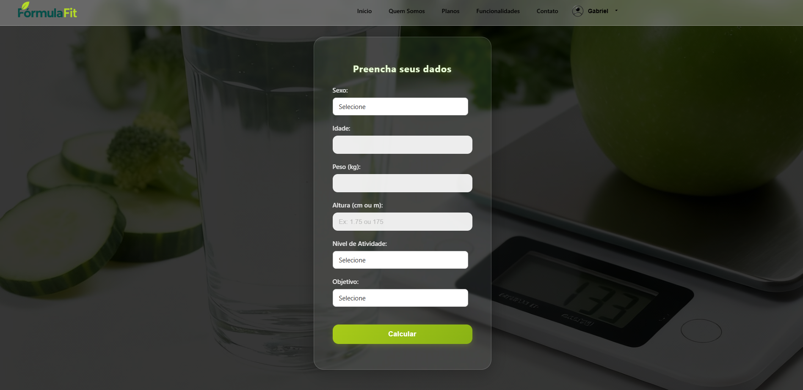
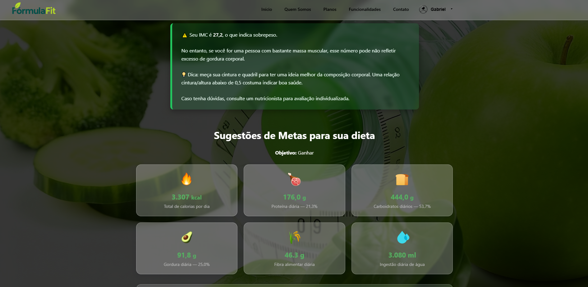
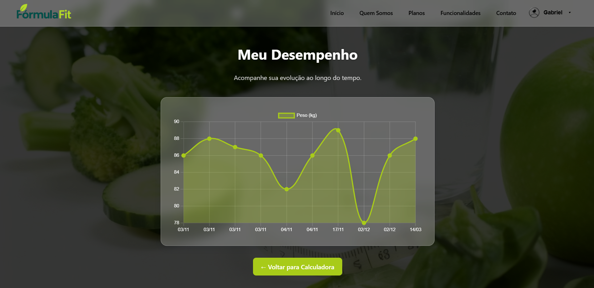

# 🥗 Calculadora Nutricional --- Macronutrientes & Dicas Alimentares

Um sistema completo desenvolvido em **PHP + MySQL** para calcular a
quantidade ideal de **macronutrientes** (proteínas, carboidratos e
gorduras) de acordo com o objetivo do usuário: **perder peso, manter o
peso ou ganhar massa muscular**.

Além disso, o sistema apresenta **orientações personalizadas**, gráficos
de desempenho, animações modernas e páginas informativas para auxiliar o
usuário durante sua evolução nutricional.

------------------------------------------------------------------------

## 🚀 Funcionalidades Principais

-   🔐 **Autenticação**
    -   Login, cadastro, logout e proteção de rotas.
-   ⚖️ **Cálculo nutricional personalizado**
    -   Usa dados como idade, peso, altura, sexo e objetivo.
    -   Calcula calorias diárias.
    -   Gera proporção de macronutrientes (carboidratos, proteínas e
        gorduras).
    -   Exibe tabela detalhada para cada objetivo.
-   📊 **Página de desempenho**
    -   Gráficos que exibem evolução e registros do usuário.
    -   Visualização dinâmica com Chart.js.
-   🧭 **Páginas informativas**
    -   Sobre\
    -   Funcionalidades\
    -   Contato\
    -   Suporte\
    -   Planos
-   🎨 **Interface moderna**
    -   Totalmente responsiva
    -   Componentes animados
    -   Campos customizados e UI refinada

------------------------------------------------------------------------

## 🛠️ Tecnologias Utilizadas

-   **PHP 7+**
-   **MySQL**
-   **HTML5 / CSS3**
-   **JavaScript**
-   **Chart.js**
-   **Custom CSS Animations**

------------------------------------------------------------------------

## 📷 Capturas de Tela

### Tela de Login


### Dashboard


### Cálculo de Macronutrientes


### Página de Desempenho

------------------------------------------------------------------------

## 📦 Como instalar e rodar localmente (XAMPP)

### 🔧 Pré-requisitos

-   XAMPP instalado (Apache + MySQL)\
-   Navegador atualizado\
-   Git (opcional)

------------------------------------------------------------------------

### **1️⃣ Clone o repositório**

``` bash
git clone https://github.com/gabrielschwanke/projeto-nutricao.git
```

Ou baixe o ZIP no GitHub.

------------------------------------------------------------------------

### **2️⃣ Mover para o diretório do servidor local**

#### Windows:

    C:\\xampp\\htdocs\\calculadora-nutricional

#### macOS / Linux:

    /opt/lampp/htdocs/calculadora-nutricional

------------------------------------------------------------------------

### **3️⃣ Inicie o servidor**

Abra o painel do XAMPP e ative:

✔ Apache\
✔ MySQL

------------------------------------------------------------------------

### **4️⃣ Criar o banco de dados**

1.  Acesse: http://localhost/phpmyadmin\
2.  Clique em **Novo**\
3.  Crie o banco de dados com o nome:

    dieta_db

4.  Vá em **Importar**\
5.  Selecione o arquivo:

    database.sql

6.  Clique em **Executar**

------------------------------------------------------------------------

### 5️⃣ Configuração do banco de dados

O arquivo `conexao.php` já está configurado para ambiente local (XAMPP).

Certifique-se apenas de que o banco criado tenha o mesmo nome definido no arquivo (`dieta_db`).

------------------------------------------------------------------------

### **6️⃣ Acessar o sistema**

Abra no navegador:

    http://localhost/calculadora-nutricional/

------------------------------------------------------------------------


## 📁 Estrutura do Projeto

calculadora-nutricional
│
├── css/              # Estilos do sistema
├── img/              # Imagens e assets
│   └── imagens/      # Screenshots usadas no README
├── conexao.php       # Conexão com banco de dados
├── login.php         # Tela de autenticação
├── dashboard.php     # Área do usuário
├── desempenho.php    # Página de gráficos
├── processa.php      # Processamento de cálculos
└── database.sql      # Estrutura do banco

## 🌐 Demonstração

🔗 **Acesse o sistema online:**

https://calculadoranutricional.lovestoblog.com
------------------------------------------------------------------------

## 👨‍💻 Autor

Gabriel Pereira Schwanke

Estudante de Análise e Desenvolvimento de Sistemas.

Projeto acadêmico desenvolvido como aplicação web full-stack utilizando PHP, MySQL e JavaScript.